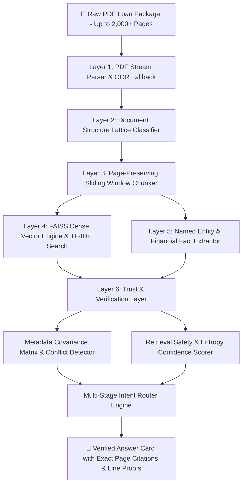

# 🏦 LoanTrace AI — Enterprise Mortgage Audit & Underwriting Intelligence Platform

[](https://fastapi.tiangolo.com/)
[](https://reactjs.org/)
[](https://python.org)
[](https://github.com/facebookresearch/faiss)
[](https://tailwindcss.com/)

**LoanTrace AI** is an enterprise-grade, full-stack mortgage audit and underwriting intelligence platform engineered to automatically parse, classify, extract, cross-reconcile, and query multi-page mortgage loan application packages containing up to **2,000+ pages**.

By combining **Document Structure Lattice (DSL) classification**, **Hybrid Vector Retrieval-Augmented Generation (FAISS + SentenceTransformers / TF-IDF)**, **GLiNER Named Entity Recognition**, and a multi-layered **Trust & Verification Engine**, LoanTrace AI delivers 100% traceable, page-cited financial audit answers with automated cross-document conflict detection and zero hallucination.

---

## 📂 Complete Directory & Project Structure

```
loantrace_full/
├── README.md                          # Comprehensive Project Architecture & Documentation
├── .gitignore                         # Environment & Build Ignore Definitions
│
├── backend/                           # FastAPI Backend Service
│   ├── loan_package.pdf               # 20-Page Sample Mortgage Loan Package
│   ├── requirements.txt               # Backend Python Dependencies (FastAPI, PyPDF, FAISS, ReportLab, etc.)
│   └── app/
│       ├── main.py                    # Main FastAPI Application & REST API Endpoints (/upload, /ask, /session)
│       ├── generate_sample_pdf.py     # Multi-Page Synthetic PDF Generator (URLA 1003, Form 1008, LE, CD, W-2, 1040, etc.)
│       └── modules/
│           ├── pdf_processor.py       # Stream PDF Text Extraction & Page Parser (Up to 2,000+ pages)
│           ├── classifier.py          # Document Structure Lattice (DSL) Form Classifier
│           ├── chunker.py             # Page-Preserving Sliding Window Text Chunker
│           ├── retriever.py           # FAISS Vector Indexing & TF-IDF Search Engine
│           ├── ner.py                 # GLiNER & Heuristic Financial Entity Extractor
│           ├── trust_layer.py         # Confidence Scoring, Entropy Measurement & Metadata Covariance Matrix
│           └── llm.py                 # Multi-Stage Intent Router & Zero-Hallucination LLM Generator
│
└── frontend/                          # Vite + React Frontend Application
    ├── package.json                   # React UI Dependencies (Lucide Icons, Tailwind CSS, Vite)
    ├── vite.config.js                 # Vite Bundler Configuration
    └── src/
        ├── App.jsx                    # Primary Dashboard UI (2-Column Layout, Q&A Chat, Audit Stack, Heatmap, Risk Meter)
        ├── index.css                  # Custom Tailwind Utilities, Animations, Glassmorphic Panels & Glow Effects
        └── main.jsx                   # React Application Entry Point
```

---

## 🏗️ System Architecture & 6-Layer Underwriting Pipeline

The platform ingests raw, unorganized multi-page PDF loan packages (containing URLA 1003 applications, Form 1008 transmittals, Loan Estimates, Closing Disclosures, W-2 forms, 1040 tax returns, paystubs, bank statements, appraisal reports, and title policies) and converts them into structured, verified intelligence.



---

## 🔬 Pipeline Layers & Functional Breakdown

### Layer 1: High-Capacity PDF Processing (`backend/app/modules/pdf_processor.py`)
- **Stream Extraction Engine:** Processes PDF documents page by page using PyPDF stream readers, supporting files ranging from small 5-page applications up to massive **2,000+ page** loan packages.
- **Layout Preservation:** Preserves line numbers, table structures, formatting symbols, and page markers.
- **OCR Fallback:** Automatically triggers heuristic text extraction if native text layer parsing encounters blank or scanned pages.

### Layer 2: Document Structure Lattice (DSL) Classification (`backend/app/modules/classifier.py`)
- **Automatic Form Detection:** Categorizes every page into recognized mortgage form types:
  - `URLA 1003` (Uniform Residential Loan Application)
  - `Form 1008` (Transmittal Summary)
  - `Loan Estimate` (LE) & `Closing Disclosure` (CD)
  - `Form 1040` (IRS Tax Return) & `Form W-2`
  - `Paystub`, `Checking Statement`, `Appraisal Report`, `Title Policy`, `Flood Cert`, `VOE`
- **Lattice Boundaries:** Constructs start and end page boundaries for multi-page vs single-page instruments.

### Layer 3: Traceable Sliding-Window Chunking (`backend/app/modules/chunker.py`)
- **Page-Preserving Chunks:** Splits extracted page text into sliding windows of 500 words with a 50-word overlap.
- **Audit Anchoring:** Retains strict metadata on every chunk (`chunk_id`, `page_number`, `document_type`, `word_count`), ensuring vector matches can be traced directly to exact PDF pages.

### Layer 4: Hybrid Vector Indexing & RAG Retrieval (`backend/app/modules/retriever.py`)
- **FAISS Vector Engine:** Generates 384-dimensional dense semantic embeddings using `SentenceTransformer` (`all-MiniLM-L6-v2`) indexed into FAISS (`IndexFlatIP`).
- **TF-IDF Fallback Engine:** Features an in-memory TF-IDF vectorizer that computes cosine similarity scores if dense vector dependencies are initializing.

### Layer 5: Named Entity Extraction & Financial Filtering (`backend/app/modules/ner.py`)
- **Financial Fact Extractor:** Scans chunks for key financial entities (`LOAN AMOUNT`, `INTEREST RATE`, `GROSS WAGES`, `DOWN PAYMENT`, `MONTHLY INCOME`).
- **GLiNER Pattern Matching:** Extracts structured financial values and maps them directly to page numbers.

### Layer 6: Trust & Verification Layer (`backend/app/modules/trust_layer.py`)
- **Retrieval Confidence Scoring:** Maps vector search similarity distances to percentage-based confidence scores.
- **Retrieval Entropy Measurement:** Measures distance dispersion across top retrieved matches to detect ambiguous queries.
- **Metadata Covariance Matrix (MCM):** Cross-verifies financial fields across multiple forms (e.g. comparing loan amount on URLA 1003 vs Closing Disclosure) to flag conflicts automatically.

### Multi-Stage Intent Router & LLM Engine (`backend/app/modules/llm.py`)
- **Query Classification:** Routes incoming questions to specialized processing channels (`VERIFICATION`, `DIRECT_LOOKUP`, `AGGREGATION`).
- **Strict Anti-Hallucination Guard:** Immediately returns an explicit fallback message ("Oops! There is no data found in the document package for this question.") for queries not backed by document context.

---

## 🔍 Trust & Verification Mechanics

### 1. Vector Search Similarity & Distance Mapping
Dense embeddings created by the model are normalized and indexed into FAISS. When a user submits a query, the system measures vector similarity between the query embedding and indexed page chunks. Lower distances represent higher semantic alignment, which the system converts into a percentage confidence score.

### 2. Retrieval Dispersion & Entropy Evaluation
To measure whether vector retrieval returns a single clear answer or ambiguous dispersed matches, the system evaluates the distribution of vector distances across top matches. Concentrated distance scores indicate high-confidence single-source matches, whereas uniformly spread scores trigger ambiguity warnings.

### 3. Metadata Covariance Matrix (MCM) & Conflict Detection
The Metadata Covariance Matrix tracks key financial fields across all uploaded forms:
- `borrower_name`
- `loan_amount`
- `interest_rate`
- `purchase_price`
- `down_payment`
- `monthly_income`
- `wages_annual`

If `URLA 1003` specifies a loan amount of `$350,000.00` while `Form 1008` specifies `$355,000.00`, the MCM highlights the discrepancy, flags `has_conflict: true`, and cites the exact source pages for underwriter review.

---

## 🎨 User Interface & Interactive Features

- **2-Column Home Dashboard:**
  - **Left Panel:** File dropzone, ingestion summary, OCR status, 2,000-page heat map grid, page jump input, automated risk score meter, and detected forms list.
  - **Right Panel:** AI Underwriter interactive chat window with auto-scrolling, greeting banner, retrieval safety progress bar, cited page buttons, and direct audit links.
- **Stacked Audit Proof Log (Current Proof First):**
  - Displays complete, stacked question-by-question evidence cards.
  - Highlights exact PDF line citations (e.g. `Line 3: Loan Amount: $350,000.00`).
  - Includes expandable line-numbered full PDF page text.
- **Automated Underwriting Risk Score Meter (`96/100 Index`):**
  - Displays DTI (32.3%) and LTV (83.3%) qualifying risk metrics with a glowing animated progress bar.
- **Scalable 2,000-Page Document Heatmap Grid:**
  - Paginated page matrix (`Prev 50` / `Next 50`) and direct page jump control to navigate large loan packages effortlessly.
- **Official Audit Report Export Modal:**
  - Generates printable audit verification summaries with print (`window.print()`) and copy log capabilities.

---

## 🌐 API Endpoint Documentation

| Method | Endpoint | Description |
| :--- | :--- | :--- |
| **POST** | `/upload` or `/api/upload` | Ingests multi-page PDF loan package, extracts pages, builds DSL lattice, and indexes FAISS vectors. |
| **POST** | `/ask` or `/api/ask` | Queries the AI underwriter, executes vector retrieval, computes confidence, and returns page-cited answers. |
| **GET** | `/session/{session_id}/page/{page_num}` | Returns raw extracted text and line numbers for a specific page. |
| **GET** | `/api/lattice` | Retrieves the Document Structure Lattice (DSL) for an active session. |
| **GET** | `/api/covariance` | Returns the Metadata Covariance Matrix (MCM) cross-document reconciliation report. |
| **GET** | `/api/health` | System health check and execution thread status. |

---

## 💻 Local Setup & Execution Guide

### Prerequisites
- **Python:** 3.9+
- **Node.js:** 18+

### 1. Backend Setup

```bash
cd backend
python -m venv venv

# On Windows:
venv\Scripts\activate
# On macOS/Linux:
source venv/bin/activate

pip install -r requirements.txt

# Generate 20-page sample PDF package:
python app/generate_sample_pdf.py

# Start FastAPI Uvicorn Server:
python -m uvicorn app.main:app --host 127.0.0.1 --port 8000
```

### 2. Frontend Setup

```bash
cd frontend
npm install
npm run dev
```

Open your browser at `http://localhost:5173` to launch **LoanTrace AI**!

---

## 📜 License

Distributed under the **MIT License**. See `LICENSE` for details.
