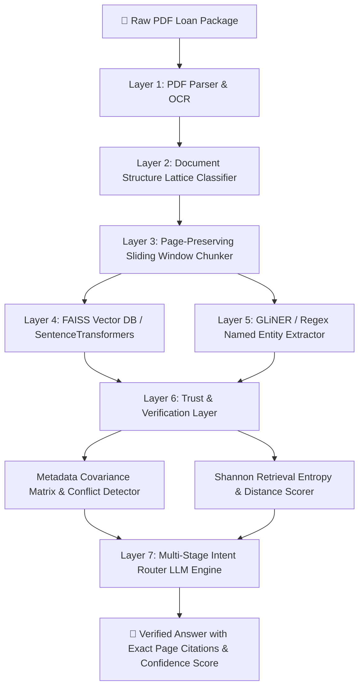

# 🏦 LoanTrace AI (AI Loan Document Analyzer & RAG System)

[](https://fastapi.tiangolo.com/)
[](https://reactjs.org/)
[](https://python.org)
[](https://github.com/facebookresearch/faiss)
[](https://www.sbert.net/)

**LoanTrace AI** is an enterprise-grade, full-stack AI platform engineered to automatically parse, classify, extract, verify, and query complex multi-page mortgage loan application packages.

By combining **Document Structure Lattice (DSL) classification**, **Hybrid Vector RAG (FAISS + SentenceTransformers / TF-IDF)**, **GLiNER Named Entity Recognition**, and a multi-layered **Trust & Verification Engine**, LoanTrace AI provides 100% traceable, page-cited financial audit answers with automated cross-document conflict detection and zero hallucination.

---

## 📐 System Architecture & Workflow

The pipeline ingests raw, unorganized multi-page PDF loan packages (containing URLA 1003 applications, W-2s, 1040 tax returns, paystubs, bank statements, closing disclosures) and converts them into structured, verified intelligence.



---

## 🔬 Core Layers & Detailed Functional Breakdown

### Layer 1: PDF Document Processing (`pdf_processor.py`)
- **Function:** `extract_pages(pdf_path: str)`
- **Mechanism:** Parses multi-page PDF documents page by page, preserving native text layout, line breaks, and page numbers.
- **Fallback Strategy:** If native text extraction fails or returns blank content, it gracefully invokes OCR / heuristic text fallbacks to guarantee uninterrupted processing.

### Layer 2: Document Structure Lattice (DSL) Classification (`classifier.py`)
- **Functions:** `classify_page_text(text: str)`, `build_document_lattice(pages: List[Dict])`
- **Mechanism:** Uses document pattern matching to detect and group individual pages into logical document instances:
  - `URLA 1003` (Uniform Residential Loan Application)
  - `Form 1008` (Transmittal Summary)
  - `Loan Estimate` (LE) & `Closing Disclosure` (CD)
  - `Form 1040` (IRS Individual Tax Return) & `Form W-2`
  - `Paystub` & `Checking Statement`
- **Lattice Metadata:** Generates start/end page ranges, page counts per document, and identifies multi-page vs single-page financial instruments.

### Layer 3: Traceable Sliding-Window Chunking (`chunker.py`)
- **Function:** `chunk_pages(pages: List[Dict], chunk_size: int = 500, overlap: int = 50)`
- **Mechanism:** Splits page text into overlapping sliding-window chunks (default: 500 words with 50-word overlap).
- **Audit Preservation:** Every chunk retains its strict `chunk_id`, original `page_number`, and `word_count`, ensuring every vector hit can be traced directly back to the exact source page.

### Layer 4: Hybrid Vector Indexing & RAG Retrieval (`retriever.py`)
- **Functions:** `build_index(chunks: List[Dict])`, `search(query: str, index: Any, chunks: List[Dict], top_k: int = 5)`
- **Vector DB Engine:**
  - Uses `all-MiniLM-L6-v2` via `SentenceTransformer` to generate 384-dimensional dense semantic embeddings.
  - Normalizes embeddings with `faiss.normalize_L2` and indexes them using `faiss.IndexFlatIP` (Inner Product on L2-normalized vectors = Cosine Similarity).
- **Fallback Engine (`FallbackTFIDFIndex`):** Lightweight in-memory TF-IDF vectorizer that calculates exact cosine distances when PyTorch/FAISS dependencies are omitted or initializing.

### Layer 5: Named Entity Recognition & Financial Filtering (`ner.py`)
- **Functions:** `regex_filter_chunks(chunks: List[Dict])`, `run_gliner_extraction(chunks: List[Dict])`
- **Mechanism:** Pre-filters chunks targeting high-value financial keywords (`LOAN AMOUNT`, `INTEREST RATE`, `GROSS PAY`, `DOWN PAYMENT`) and applies GLiNER heuristic extraction to extract structured facts mapped directly to page citations.

### Layer 6: Trust & Verification Layer (`trust_layer.py`)
- **Functions:** 
  - `confidence_from_distance(distance: float)`: Maps vector cosine distance to percentage confidence scores.
  - `calculate_retrieval_entropy(results: List[Dict])`: Computes Shannon entropy over retrieval distance scores to evaluate vector dispersion.
  - `build_metadata_covariance_matrix(documents: List[Dict])`: Generates the **Metadata Covariance Matrix (MCM)** to detect discrepancies across documents (e.g. loan amount on URLA 1003 vs Closing Disclosure).
  - `get_thread_semaphore_status()`: Audits thread execution and max concurrency limits.

### Layer 7: Multi-Stage Intent-Routed LLM Engine (`llm.py`)
- **Functions:** 
  - `classify_query(question: str)`: Routes queries to `DIRECT_LOOKUP`, `AGGREGATION`, or `VERIFICATION` routes.
  - `generate_answer(question: str, retrieved_chunks: List[Dict])`: Synthesizes exact answers backed by page citations.
  - **Strict Anti-Hallucination Guard:** Immediately returns `NO_DATA_MSG` ("Oops! There is no data found in the document package for this question.") for off-topic, non-existent, or low-confidence vector queries.

---

## 🧮 Vector Database & Mathematical Foundations

### 1. Vector Embeddings & Cosine Distance Formula
For a query vector $\vec{q}$ and chunk embedding vector $\vec{d}$:

$$\text{Cosine Similarity} = \cos(\theta) = \frac{\vec{q} \cdot \vec{d}}{\|\vec{q}\| \|\vec{d}\|}$$

$$\text{Vector Distance} = 1.0 - \max(0.0, \min(1.0, \cos(\theta)))$$

$$\text{Confidence Score (\%)} = \max\left(0, \min\left(100, \left(1.0 - \text{Distance}\right) \times 100\right)\right)$$

### 2. Shannon Entropy of Retrieval Confidence
To measure retrieval ambiguity across the top-K retrieved vector matches, LoanTrace AI calculates Shannon Entropy $H(X)$:

$$P(d_i) = \frac{d_i}{\sum_{j=1}^{K} d_j}$$

$$H(X) = - \sum_{i=1}^{K} P(d_i) \log_2 P(d_i)$$

- **Low Entropy:** High confidence concentration (one or two highly relevant chunk matches).
- **High Entropy:** Uniformly dispersed distance scores, indicating potential document ambiguity.

### 3. Metadata Covariance Matrix (MCM) & Cross-Document Reconciliation
The Metadata Covariance Matrix checks cross-document alignment across tracked financial fields:
- `borrower_name`
- `loan_amount`
- `interest_rate`
- `purchase_price`
- `down_payment`
- `monthly_income`
- `wages_annual`

If `URLA 1003` specifies a loan amount of `$350,000.00` while `Form 1008` specifies `$355,000.00`, the MCM highlights `has_conflict: true` and flags exact source pages for audit.

---

## 🌟 What Makes LoanTrace AI Unique?

1. **Zero-Hallucination Guarantee:** If a user asks about items not in the loan package (e.g. weather, flood insurance policies, car loans), the system safely returns `NO_DATA_MSG` rather than fabricating an answer.
2. **Page-Level Traceability:** Every chunk, entity, and LLM response is anchored to exact page numbers (e.g. `(Page 1)`, `(Page 5)`).
3. **Document Structure Lattice (DSL):** Reconstructs the structural hierarchy of multi-page loan packages instead of treating PDFs as flat unstructured text.
4. **Metadata Covariance Matrix (MCM):** Automatically performs cross-document reconciliation across multiple financial forms to catch fraud, typos, or discrepancies.
5. **Dual Vector Engine with Auto-Fallback:** Operates with FAISS + `all-MiniLM-L6-v2` dense embeddings, with an automatic fallback to an in-memory TF-IDF vector index if dependencies are loading.

---

## 🌐 API Endpoint Documentation

| Method | Endpoint | Description |
| :--- | :--- | :--- |
| **POST** | `/api/upload` | Uploads and processes a PDF loan package (`session_id`, lattice extraction, vector indexing). |
| **POST** | `/api/ask` | Accepts user questions, performs vector retrieval, calculates entropy & confidence, and returns page-cited answers. |
| **GET** | `/api/lattice` | Retrieves the Document Structure Lattice (DSL) for an active session. |
| **GET** | `/api/covariance` | Returns the Metadata Covariance Matrix (MCM) and cross-document conflict report. |
| **GET** | `/api/health` | System health check and thread semaphore concurrency status. |

---

## 💻 Local Setup & Installation

### Prerequisites
- **Python:** 3.9+
- **Node.js:** 18+

### 1. Backend Setup

```bash
cd backend
python -m venv venv

# On Windows:
venv\Scripts\activate
# On macOS/Linux:
source venv/bin/activate

pip install -r requirements.txt
uvicorn app.main:app --reload --port 8000
```

### 2. Frontend Setup

```bash
cd frontend
npm install
npm run dev
```

Open your browser at `http://localhost:5173` to launch the **LoanTrace AI** interactive visual dashboard!

---

## 📜 License

Distributed under the **MIT License**. See `LICENSE` for more information.
